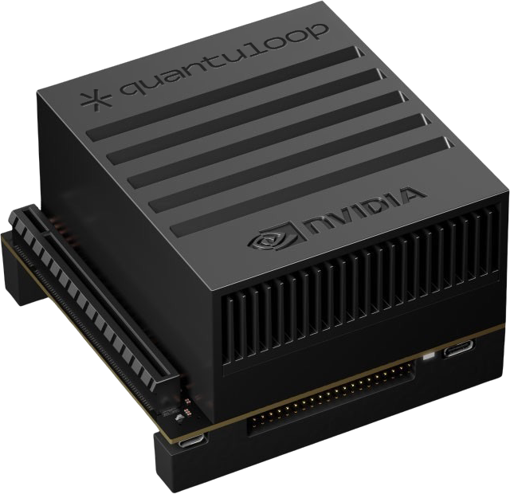

Bem vindo a página do QuBOX
===========================
  
QuBOX é um simulador de computação quântica portátil desenvolvido para a linguagem Ket.
Acelerado por GPU, QuBOX possui dois modos de simulação, sendo capaz de simular mais de 30 bits quânticos.
Ket é um projeto open-source que tem como objetivo facilitar o desenvolvimento de aplicações clássicas-quânticas. 
Embarcada em Python, a linguagem Ket traz construções intuitivas para a construção de programas com integração de dados clássicos e quânticos.

Em parceria com a startup Quantuloop, o Grupo de Computação Quântica - UFSC disponibiliza acesso remoto e gratuito a um simulador QuBOX. Cadastre-se para receber sua chave de acesso.

.. grid:: 2

    .. grid-item-card:: Simulador QuBOX
        :link: qubox
        :link-type: doc
        :text-align: center
    

    .. grid-item-card:: Linguagem Ket
        :link: ket
        :link-type: doc
        :text-align: center

.. grid:: 2

    .. grid-item-card:: Sobre o Projeto
        :link: projeto
        :link-type: doc
        :text-align: center
    

    .. grid-item-card:: Sobre o GCQ-UFSC
        :link: gcq
        :link-type: doc
        :text-align: center

 
    
Apoio
-----

Esse projeto é uma parceria entre o **Centro de Ciências Físicas e Matemáticas** (CFM) e o **Departamento de Informática e Estatística** (INE/CTC) da **Universidade Federal de Santa Catarina** (UFSC) através do **Grupo de Computação Quântica - UFSC**.

.. list-table:: 
    :class: only-light
    :align: center
    :widths: 8 8 8 8

    * - .. figure:: _static/brasao_UFSC_vertical_extenso.svg

      - .. figure:: _static/cfm.jpg

      - .. figure:: _static/ine.png

      - .. figure:: _static/quantuloop.svg

.. list-table:: 
    :class: only-dark
    :align: center
    :widths: 8 8 8 9

    * - .. figure:: _static/brasao_UFSC_vertical_sigla_fundoescuro.svg

      - .. figure:: _static/cfm.jpg

      - .. figure:: _static/ine_fundoescuro.png

      - .. figure:: _static/quantuloop_white.svg

.. topic:: E-mail para contato

    | QuBOX UFSC: qubox.cfm@contato.ufsc.br
    | Quantuloop: contact@quantuloop.com

.. toctree::
    :maxdepth: 2
    :hidden:   

    qc
    qubox
    ket
    projeto
    gcq  
    publicacoes
    algoritmos/index

.. TODO: alterar link do GCQ após atualização do site.

.. toctree::
    :maxdepth: 2
    :hidden:
    :caption: Links

    Documentação do Ket (inglês) <https://quantumket.org>
    GCQ-UFSC <http://gcq.ufsc.br>
    CFM-UFSC <https://cfm.ufsc.br>
    INE/CTC-UFSC <https://ine.ufsc.br>

