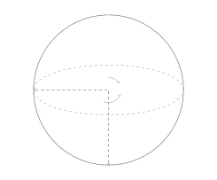
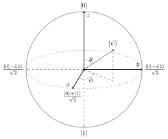
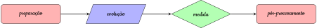
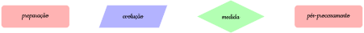

Computação Quântica
===================

Breve Histórico
---------------

No início do século XX os cientistas enfrentavam um grande problema, que era explicar o comportamento da radiação emitida por um corpo negro.
A solução desse problema levou ao surgimento da Mecânica Quântica, que segundo a hipótese de Max Planck “a radiação só pode ser emitida ou absorvida por um corpo negro em quantidades múltiplas inteiras de :math:`hf`”, em que :math:`h \approx 6,62 \cdot 10^{-34} J \cdot s` é a constante de Planck e :math:`f` é a frequência de radiação.
A quantização da energia e de outras grandezas na escala atômica foi importante para explicar uma série de outros fenômenos, como por exemplo o efeito fotoelétrico e o espectro da radiação emitida por átomos e moléculas.
O desenvolvimento da Mecânica Quântica nos permitiu compreender melhor o comportamento da matéria na escala microscópica, nesse caso particular, os materiais semicondutores, que permitiram a criação do transistor.
Os transistores substituíram as válvulas usadas nos primeiros computadores digitais a partir de 1955.
É importante notar que a lógica usada para realizar as operações computacionais nos nossos notebooks, PCs, tablets e smartphones é a lógica booleana, ou seja, uma lógica clássica que envolve operações como AND, OR e NOT sobre os bits 0 e 1.
Devido a suas grande capacidade de cálculo e armazenamento, os computadores são fundamentais para o desenvolvimento de qualquer sociedade moderna.
Essa é a chamada primeira revolução quântica.

Um dos grandes impulsionadores da computação quântica foi o físico Richard Feynman, que no início da década de 80 sugeriu o uso de computadores quânticos para simular sistemas quânticos.
A percepção de Feynman baseia-se no fato de que o número de configurações possíveis nos sistemas quânticos cresce de maneira exponencial com o número de entes (spins, elétrons, átomos, ...) considerados, tornando-se proibitivo para a memória dos computadores atuais guardar tanta informação mesmo para um número pequeno (:math:`< 100`) de partículas.

Na década seguinte, os primeiros algoritmos quânticos começaram a surgir, dentre eles, os que mais se destacaram foram o algoritmo de busca de Grover e o de fatoração de Shor.
Este último algoritmo foi provavelmente um dos grandes responsáveis pelo desenvolvimento da computação quântica, já que é capaz de encontrar os fatores primos :math:`p` e :math:`q` que multiplicados resultavam em um número inteiro :math:`N = p \cdot q` em uma escala de tempo que cresce polinomialmente com o tamanho do número :math:`N`.
Ou seja, a base do sistema de segurança RSA, amplamente usado para realizar transações bancárias no mundo todo, pode estar comprometida a partir da existência de computadores quânticos de larga escala.

A partir da segunda década do século XXI, não apenas a computação quântica, mas outras áreas como criptografia quântica, sensores quânticos e simulação quântica tem recebido forte atenção não apenas do setor acadêmico, mas também do setor industrial.
Dessa forma, tem-se observado o rápido desenvolvimento das chamadas tecnologias quânticas, o que configura a segunda revolução quântica, uma vez que a lógica por trás dos processos é de natureza quântica.

Desenvolvimento Atual
---------------------

A Computação Quântica ainda está em fase de amadurecimento, mas já mostra o seu grande potencial para resolver problemas práticos, além do algoritmo de fatoração de Shor e de busca de Grover, tais como problemas de otimização, machine learning, logística, química quântica, finanças, álgebra linear, entre outros.
Nos últimos cinco anos, grandes empresas como Google, IBM, Amazon e Microsoft intensificaram ainda mais os seus investimentos no setor, além de vários governos de diversos países da América do Norte, Europa, Oceania e Ásia.
Um dos grande temores em relação ao computadores quânticos está relacionado à segurança da informação, que afeta não apenas as transações bancárias, mas toda e qualquer transmissão de informação sigilosa, incluindo a militar, naturalmente.
Tentativas de barrar possíveis ataques por computadores quânticos incluem a criptografia pós-quântica, que apesar do nome, se baseia em métodos criptográficos clássicos.

Para quem estiver interessado em aprender computação quântica, vale lembrar que algumas empresas disponibilizam computadores quânticos reais, simuladores, kits e linguagens para desenvolvimento de algoritmos ao público geral.
Por exemplo, é possível acessar gratuitamente o kit de desenvolvimento quântico criado pela IBM (`Qiskit <https://qiskit.org/>`_) e rodar algoritmos em alguns dos seus computadores quânticos com poucos qubits.
Através deste projeto será possível programar em um simular quântico de até 30 qubits de maneira gratuita, através da linguagem `Ket <https://quantumket.org/>`_ e do simulador `QuBOX <https://qubox.ufsc.br/qubox.html>`_.

O que é um qubit?
-----------------

O qubit (**qu**\ antum + **bit**) é um bit quântico.
O bit clássico sempre está em um dos possíveis estados 0 ou 1, já um qubit pode estar em ambas configurações simultaneamente.
Chamamos esse fenômeno de `superposição`.
Para representar um qubit utilizamos a notação Dirac ou `braket`:

.. math::
    \left | \psi \right \rangle = \begin{bmatrix} a \\ b \end{bmatrix} = a \left| 0 \right \rangle + b \left| 1 \right \rangle

em que :math:`a` e :math:`b` são `amplitudes de probabilidade` (números complexos), de modo que

.. math::
    |a|^2 \text{ representa a probabilidade de após uma medida encontrar o sistema no estado}
    \left| 0 \right\rangle

    |b|^2 \text{ representa a probabilidade de após uma medida encontrar o sistema no estado}
    \left| 1 \right\rangle

Como a probabilidade total deve somar :math:`100\%`, temos que a `condição de normalização` para o estado :math:`\left| \psi \right\rangle` é :math:`|a|^2 + |b|^2 = 1`.

Esfera de Bloch
^^^^^^^^^^^^^^^

Os estados de um qubit podem ser representados por meio de pontos em uma superfície esférica de raio unitário, utilizando o sistema de coordenadas esféricas.
Para isso, vamos parametrizar o estado do qubit :math:`\left| \psi \right\rangle = a \left| 0 \right\rangle + b \left| 1 \right\rangle` da seguinte forma

..
    Como :math:`a, b \in \mathbb{C}` podemos escrever :math:`a` e :math:`b` na forma polar.

    .. math::
        \begin{matrix}
            a &=& p_a e^{i\theta_a} \\
            b &=& p_b e^{i\theta_b}
        \end{matrix}

    Além disso, tem-se

    .. math::
        \begin{cases}
            |a| &=& p_a \\
            |b| &=& p_b \\
            |a|^2 + |b|^2 &=& 1 \\
        \end{cases}
        \qquad
        \Rightarrow
        p_a^2 + p_b^2 = 1

    Usando a relação fundamental da trigonometria, é possível escrever da seguinte forma

    .. math::
        \begin{cases}
            p_a &=& \cos\left( \dfrac{\theta}{2} \right) \\
            p_b &=& \sin\left( \dfrac{\theta}{2} \right)
        \end{cases}
        \qquad
        \theta \in [0, \pi]

    Reescrevendo o estado :math:`\left| \psi \right\rangle`

    .. math::
        \begin{matrix}
            \left| \psi \right\rangle &=& \cos\left(  \dfrac{\theta}{2} \right) e^{i\theta_a} \left| 0 \right\rangle + \sin\left( \dfrac{\theta}{2} \right) e^{i\theta_b} \left| 1 \right\rangle \\
            &=& e^{i\theta_a} \left[ \cos\left(  \dfrac{\theta}{2} \right) \left| 0 \right\rangle + \sin\left( \dfrac{\theta}{2} \right) e^{i\left(\theta_b - \theta_a\right)} \left| 1 \right\rangle \right]
        \end{matrix}

    Usando o conceito de fase global, é possível tornar o coeficiente de :math:`\left| 0 \right\rangle` um número real positivo.
    Também é possível definir :math:`\varphi = \theta_b - \theta_a`, com isso

.. math::
    \left| \psi \right\rangle = \cos\left(  \dfrac{\theta}{2} \right) \left| 0 \right\rangle + e^{i\phi} \sin\left( \dfrac{\theta}{2} \right) \left| 1 \right\rangle \text{ tal que } \theta \in [0, \pi], \phi \in [0, 2\pi)

Agora, utilizando :math:`\theta` e :math:`\phi` no sistemas de coordenadas esféricas, tem-se a Esfera de Bloch.
Todos os estados acessíveis a um qubit podem ser representados utilizando-se a esfera de Bloch.

Representação de 2 ou mais qubits
^^^^^^^^^^^^^^^^^^^^^^^^^^^^^^^^^

Existem diversas formas de se representar um sistema de 2 qubits, seguem algumas equivalências:

.. math::
    \left| \psi_0 \right\rangle \otimes \left| \psi_1 \right\rangle = \left| \psi_0 \right\rangle \left| \psi_1 \right\rangle = \left| \psi_0 \psi_1 \right\rangle

em que :math:`\otimes` é produto tensorial de :math:`\psi_0` com :math:`\psi_1`.
Seja

.. math::
    \left| \psi_0 \right\rangle \otimes \left| \psi_1 \right\rangle
    = \begin{bmatrix} a_0 \\ a_1 \end{bmatrix} \otimes \begin{bmatrix} b_0 \\ b_1 \end{bmatrix}
    = \begin{bmatrix} a_0 b_0 \\ a_0 b_1 \\ a_1 b_0 \\ a_1 b_1 \end{bmatrix}

De forma análoga, é possível representar sistemas de :math:`n` qubits como

.. math::
    \left| \psi_0 \right\rangle \otimes \left| \psi_1 \right\rangle \otimes \dots \otimes \left| \psi_n \right\rangle
    = \left| \psi_0 \right\rangle \left| \psi_1 \right\rangle \dots \left| \psi_n \right\rangle
    = \left| \psi_0 \psi_1 \dots \psi_n \right\rangle

.. note::

    A superposição de estados desse tipo pode levar ao emaranhamento.

Etapas de um Algoritmo Quântico
-------------------------------

De forma geral, podemos separar um algoritmo quântico em quatro etapas.

#. **Preparação**: aqui cada qubit é inicializado em algum estado, geralmente em :math:`\left| 0 \right\rangle`.
#. **Evolução**: nessa parte o algoritmo é de fato aplicado, através das portas lógicas quânticas.
#. **Medida**: após a aplicação das portas, é necessário medir os qubits, para se ter o resultado do circuito.
#. **Pós-processamento**: finalmente, nessa etapa o resultado obtido deve ser interpretado de acordo com o contexto.

Comparação com Computação Clássica
----------------------------------

Entradas e Saídas
^^^^^^^^^^^^^^^^^

* **Clássica**: portas podem ter diferentes números de bits entrando e saindo.

.. topic:: Exemplo
    
    A porta AND possui dois ou mais bits de entrada e apenas um de saída.

    .. image:: _static/gates/and_dark.svg
        :width: 15%
        :align: center
        :class: only-dark, no-scaled-link

    .. image:: _static/gates/and.svg
        :width: 15%
        :align: center
        :class: only-light, no-scaled-link

        
* **Quântica**: portas possuem mesmo número de qubits na entrada e na saída.

Reversibilidade
^^^^^^^^^^^^^^^

* **Clássica**: a maioria das portas clássicas não são reversíveis, isto é, dado uma saída não conseguimos identificar quais foram as entradas.

.. topic:: Exemplo

    Na porta OR de dois bits podemos obter 1 como saída em três casos.

    .. math::

        \begin{array}{cc|c}
            X & Y & X \text{ OR } Y \\
            0 & 0 & 0 \\
            0 & 1 & 1 \\
            1 & 0 & 1 \\
            1 & 1 & 1 \\
        \end{array}

    Sabendo que a saída foi 1 não é possível identificar qual/quais bits eram 1.

* **Quântica**: seus circuitos são reversíveis, isso ocorre, pois, seus operadores são unitários.

.. topic:: Observação
    
    Embora a evolução temporal seja reversível durante o processamento da informação no circuito quântico, a medição dos qubits é um processo irreversível.

Portas Lógicas Quânticas
------------------------

As portas lógicas quânticas são operações `unitárias` que ao atuar em um estado inicial levam para outro estado final, ou seja, funcionam como rotações na esfera de Bloch.
A seguir, alguns exemplos de portas lógicas quânticas que atuam sobre um qubit.

Porta X
^^^^^^^

Essa porta é o equivalente a porta NOT da computação clássica.

.. tab:: Matriz

    .. math::

        X = \sigma_x =
        \begin{bmatrix}
            0 & 1 \\
            1 & 0
        \end{bmatrix}

.. tab:: Comportamento

    .. math::

        \begin{matrix}
            X \left| 0 \right\rangle &=& \left| 1 \right\rangle \\
            X \left| 1 \right\rangle &=& \left| 0 \right\rangle
        \end{matrix}

.. tab:: Símbolo

    .. image:: _static/gates/xgate_dark.svg
        :width: 15%
        :align: center
        :class: only-dark, no-scaled-link

    .. image:: _static/gates/xgate.svg
        :width: 15%
        :align: center
        :class: only-light, no-scaled-link

    .. image:: _static/gates/targgate_dark.svg
        :width: 15%
        :align: center
        :class: only-dark, no-scaled-link

    .. image:: _static/gates/targgate.svg
        :width: 15%
        :align: center
        :class: only-light, no-scaled-link

Porta Y
^^^^^^^

.. tab:: Matriz

    .. math::

            Y = \sigma_y =
            \begin{bmatrix}
                0 & -i \\
                i & 0
            \end{bmatrix}

.. tab:: Comportamento

    .. math::

        \begin{matrix}
            Y \left| 0 \right\rangle &=& i\left| 1 \right\rangle \\
            Y \left| 1 \right\rangle &=& -i\left| 0 \right\rangle
        \end{matrix}

.. tab:: Símbolo

    .. image:: _static/gates/ygate_dark.svg
        :width: 15%
        :align: center
        :class: only-dark, no-scaled-link

    .. image:: _static/gates/ygate.svg
        :width: 15%
        :align: center
        :class: only-light, no-scaled-link

Porta Z
^^^^^^^

A porta Z introduz uma fase relativa de :math:`\pi` entre os estados da base computacional.

.. tab:: Matriz

    .. math::

        Z = \sigma_z =
        \begin{bmatrix}
            1 & 0 \\
            0 & -1
        \end{bmatrix}

.. tab:: Comportamento

    .. math::

        \begin{matrix}
            Z \left| 0 \right\rangle &=& \left| 0 \right\rangle \\
            Z \left| 1 \right\rangle &=& -\left| 1 \right\rangle
        \end{matrix}

.. tab:: Símbolo

    .. image:: _static/gates/zgate_dark.svg
        :width: 15%
        :align: center
        :class: only-dark, no-scaled-link

    .. image:: _static/gates/zgate.svg
        :width: 15%
        :align: center
        :class: only-light, no-scaled-link

Porta Hadamard
^^^^^^^^^^^^^^

Essa porta gera uma superposição dos estados da base computacional.

.. tab:: Matriz

    .. math::

        H = \dfrac{1}{\sqrt{2}}
        \begin{bmatrix}
            1 & 1 \\
            1 & -1
        \end{bmatrix}

.. tab:: Comportamento

    .. math::

        \begin{matrix}
            H \left| 0 \right\rangle &=& \dfrac{1}{\sqrt{2}} \left( \left| 0 \right\rangle + \left| 1 \right\rangle \right) &=& \left| + \right\rangle \\
            H \left| 1 \right\rangle &=& \dfrac{1}{\sqrt{2}} \left( \left| 0 \right\rangle - \left| 1 \right\rangle \right) &=& \left| - \right\rangle \\
        \end{matrix}

.. tab:: Símbolo

    .. image:: _static/gates/hgate_dark.svg
        :width: 15%
        :align: center
        :class: only-dark, no-scaled-link

    .. image:: _static/gates/hgate.svg
        :width: 15%
        :align: center
        :class: only-light, no-scaled-link

Portas Controladas
^^^^^^^^^^^^^^^^^^

Para se fazer computação quântica universal, ou seja, realizar todas as transformações unitárias desejadas entre os qubits de entrada e saída em um algoritmo, é necessário realizar operações que façam dois ou mais qubits interagirem entre si.
Tais portas podem envolver um qubit de controle e o outro como alvo, sendo possível generalizá-la para múltiplos qubits de controle e de alvo.
Segue o exemplo para porta controlada X, ou CNOT, com um controle e um alvo.

.. tab:: Matriz

    .. math::

        \text{CNOT} =
        \begin{bmatrix}
            1 & 0 & 0 & 0 \\
            0 & 1 & 0 & 0 \\
            0 & 0 & 0 & 1 \\
            0 & 0 & 1 & 0
        \end{bmatrix}

.. tab:: Comportamento

    .. math::

        \begin{matrix}
            \text{CNOT} \left| 00 \right\rangle &=& \left| 00 \right\rangle \\
            \text{CNOT} \left| 01 \right\rangle &=& \left| 01 \right\rangle \\
            \text{CNOT} \left| 10 \right\rangle &=& \left| 11 \right\rangle \\
            \text{CNOT} \left| 11 \right\rangle &=& \left| 10 \right\rangle
        \end{matrix}

.. tab:: Símbolo

    .. image:: _static/gates/cxgate_dark.svg
        :width: 15%
        :align: center
        :class: only-dark, no-scaled-link

    .. image:: _static/gates/cxgate.svg
        :width: 15%
        :align: center
        :class: only-light, no-scaled-link

    .. image:: _static/gates/ctarggate_dark.svg
        :width: 15%
        :align: center
        :class: only-dark, no-scaled-link

    .. image:: _static/gates/ctarggate.svg
        :width: 15%
        :align: center
        :class: only-light, no-scaled-link

Emaranhamento
-------------

Estados emaranhados são aqueles que não podem ser escritos como produto tensorial de estados de 1 qubit, ou seja, não é possível separá-los.
Os mais conhecidos são os estados de Bell, os quais envolvem apenas 2 qubits, sendo dados por:

.. math::
    \begin{matrix}
        \left| \beta_{00} \right\rangle &=& \left| \Phi^+ \right\rangle &=& \dfrac{1}{\sqrt{2}} \left( \left| 00 \right\rangle + \left| 11 \right\rangle \right) \\
        \left| \beta_{01} \right\rangle &=& \left| \Phi^- \right\rangle &=& \dfrac{1}{\sqrt{2}} \left( \left| 00 \right\rangle - \left| 11 \right\rangle \right) \\
        \left| \beta_{10} \right\rangle &=& \left| \Psi^+ \right\rangle &=& \dfrac{1}{\sqrt{2}} \left( \left| 01 \right\rangle + \left| 10 \right\rangle \right) \\
        \left| \beta_{11} \right\rangle &=& \left| \Psi^- \right\rangle &=& \dfrac{1}{\sqrt{2}} \left( \left| 01 \right\rangle - \left| 10 \right\rangle \right)
    \end{matrix}

.. note::

    Estados emaranhados são apontados como sendo os responsáveis por fazer não apenas a computação quântica mais veloz do que a computação clássica, mas também permitem aumentar a precisão de medidas de observáveis físicos e realizar comunicação de forma segura.

Criando um Estado de Bell
^^^^^^^^^^^^^^^^^^^^^^^^^

Já vimos o que é o emaranhamento, agora vamos criá-lo.
Como exemplo, criaremos o estado :math:`\left| \beta_{00} \right\rangle`, abaixo pode-se optar por ver o circuito ou o código em Ket.

.. tab:: Circuito

    .. image:: _static/bell_state.svg
        :width: 50%
        :align: center
        :class: only-light, no-scaled-link

    .. image:: _static/bell_state_dark.svg
        :width: 50%
        :align: center
        :class: only-dark, no-scaled-link

.. tab:: Código

    .. code-block:: ket

        q0, q1 = quant(2)   # cria dois qubits
        H(q0)               # aplica a porta de Hadamard no qubit 0
        ctrl(q0, X, q1)     # aplica a porta X no qubit 1, com o qubit 0 como controle

Seja :math:`\left| \psi \right\rangle = q_0 \otimes q_1`.
Após a aplicação da porta de Hadamard, teremos :math:`q_0 = \dfrac{1}{\sqrt{2}} \left( \left| 0 \right\rangle + \left| 1 \right\rangle \right)`, conforme visto anteriormente.
Logo,

.. math::

    \begin{matrix}
        \left| \psi \right\rangle &=&    \dfrac{1}{\sqrt{2}} \left( \left| 0 \right\rangle + \left| 1 \right\rangle \right) \otimes \left| 0 \right\rangle \\
        &=& \dfrac{1}{\sqrt{2}} \left( \left| 00 \right\rangle + \left| 10 \right\rangle\right)
    \end{matrix}

Na sequência, temos uma porta CNOT, com o qubit 0 como controle e o qubit 1 como alvo.
Gerando a seguinte situação

.. math::

    \begin{matrix}
        \left| \psi \right\rangle &=&        \text{CNOT} \left[ \dfrac{1}{\sqrt{2}} \left( \left| 00 \right\rangle + \left| 10 \right\rangle\right) \right] \\
        &=& \dfrac{1}{\sqrt{2}} \left( \text{CNOT} \left| 00 \right\rangle + \text{CNOT} \left| 10 \right\rangle \right) \\
        &=& \dfrac{1}{\sqrt{2}} \left( \left| 00 \right\rangle + \left| 11 \right\rangle \right) \\
        &=& \left| \beta_{00} \right\rangle
    \end{matrix}

Portanto, com apenas duas portas é possível gerar uma situação de emaranhamento.

.. tip::

    Se você se interessou por computação quântica e quer se aprofundar um pouco mais no assunto, recomendamos o livro:

    Michael A. Nielsen and Isaac L. Chuang. *Quantum Computation and Quantum Information – 10th Anniversary Edition*. Cambridge University Press, 10th anv edition, 2010. https://doi.org/10.1017/CBO9780511976667.
